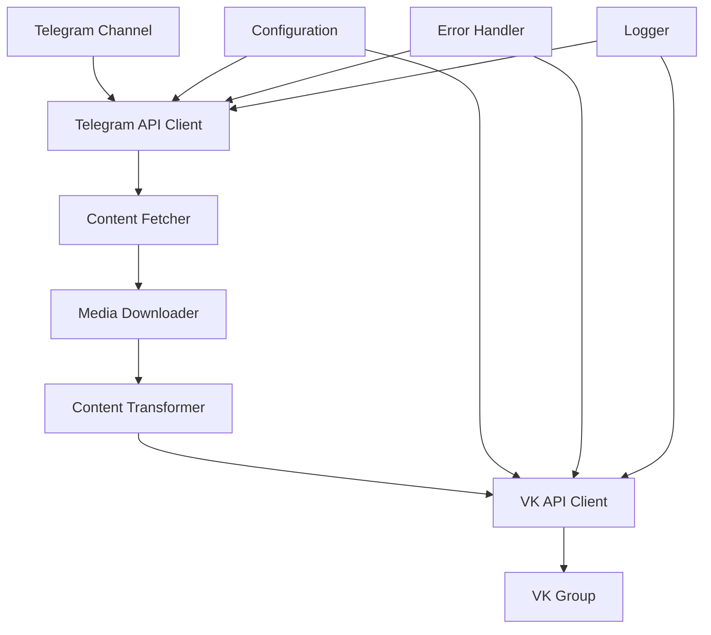

# Telegram to VK Content Transfer - Documentation

## Overview
A pure Go application for transferring content from Telegram channels to VK (VKontakte) groups. Designed for one-time historical data transfer with support for text, photos, videos, and documents.

## Quick Start

### 1. Prerequisites
- Go 1.19+ (for building from source)
- Telegram bot token (from @BotFather)
- VK access token with required permissions
- VK group ID

### 2. Installation
```bash
# Clone the repository
git clone https://github.com/yourusername/ai-transfer-tg-to-vk.git
cd ai-transfer-tg-to-vk

# Build the application
go build -o transfer ./cmd/transfer

# Or install globally
go install ./cmd/transfer
```

### 3. Minimal Configuration
Create `config.yaml` with just 4 values:
```yaml
telegram:
  bot_token: "123456:ABC-DEF1234ghIkl-zyx57W2v1u123ew11"
  channel_id: "@your_channel"

vk:
  access_token: "vk1.a.abcdef1234567890"
  group_id: 123456789
```

### 4. Test Run (Dry Mode)
```bash
# Default is dry-run mode - won't post anything
./transfer

# Or explicitly
./transfer --dry-run
```

### 5. Actual Transfer
```yaml
# config.yaml - set dry_run to false
transfer:
  dry_run: false
```

```bash
./transfer
```

## Detailed Setup Guide

### Step 1: Get Telegram Bot Token
1. Open Telegram and search for `@BotFather`
2. Send `/newbot` and follow instructions
3. Save the bot token (format: `123456:ABC-DEF...`)
4. Add the bot as admin to your channel

### Step 2: Get VK Access Token
1. Go to https://vk.com/dev
2. Create a new standalone application
3. Get access token with these permissions:
   - `wall` (post to wall)
   - `photos` (upload photos)
   - `video` (upload videos)
   - `docs` (upload documents)
   - `groups` (post to groups)
   - `offline` (token doesn't expire)

### Step 3: Get VK Group ID
1. Go to your VK group
2. The group ID is in the URL: `https://vk.com/club123456789` → `123456789`
3. Or `https://vk.com/public123456789` → `-123456789` (negative for public pages)

### Step 4: Configure and Run
```bash
# Generate example config
./transfer --generate-config

# Edit config.yaml with your credentials
nano config.yaml

# Test with dry run (default)
./transfer

# Run actual transfer
./transfer --dry-run=false
```

## Configuration

### Minimal Configuration (Required)
```yaml
telegram:
  bot_token: "YOUR_BOT_TOKEN"
  channel_id: "@your_channel"  # or chat_id: -1001234567890

vk:
  access_token: "YOUR_VK_TOKEN"
  group_id: 123456789
```

### Full Configuration Example
```yaml
telegram:
  bot_token: "123456:ABC..."
  channel_id: "@my_channel"
  # Optional: max_posts: 100  # Limit number of posts
  # Optional: start_date: "2023-01-01"
  # Optional: end_date: "2023-12-31"

vk:
  access_token: "vk1.a.abc..."
  group_id: 123456789
  from_group: true
  post_delay: "3s"  # Delay between posts

transfer:
  dry_run: false    # Set to true for testing
  include_media: true
  skip_duplicates: true

media:
  temp_dir: "./temp"  # Temporary files
  keep_files: false   # Clean up after transfer

logging:
  level: "info"       # debug, info, warn, error
  output_path: "./logs/transfer.log"
```

### Environment Variables (for production)
```bash
export TG2VK_TELEGRAM_BOT_TOKEN="123456:ABC..."
export TG2VK_TELEGRAM_CHANNEL_ID="@my_channel"
export TG2VK_VK_ACCESS_TOKEN="vk1.a.abc..."
export TG2VK_VK_GROUP_ID="123456789"

# Run without config file
./transfer
```

## Command Line Options

```bash
./transfer [options]

Options:
  --config string          Path to config file (default "config.yaml")
  --dry-run               Test mode, don't post (default true)
  --max-posts int         Maximum posts to transfer (0=all)
  --start-date string     Start date (YYYY-MM-DD)
  --end-date string       End date (YYYY-MM-DD)
  --log-level string      Log level (debug, info, warn, error)
  --generate-config       Generate example config file
  --help                  Show help
```

## Features

### Content Transfer
- **Text Posts**: With formatting preservation (bold, italic, links)
- **Photos**: JPEG, PNG, GIF, WebP with automatic optimization
- **Videos**: MP4, AVI, MOV, etc. with size limits
- **Documents**: PDF, DOC, ZIP, etc.
- **Audio**: MP3, OGG, WAV files
- **Voice Messages**: Converted to audio
- **GIFs**: Converted to MP4 for better compatibility

### Smart Features
- **Duplicate Detection**: Skips already transferred content
- **Rate Limiting**: Respects both Telegram and VK API limits
- **Error Recovery**: Continues on errors, can resume interrupted transfers
- **Progress Tracking**: Checkpoint system for resumable transfers
- **Dry Run Mode**: Test without posting

### Safety Features
- **Dry Run by Default**: Prevents accidental posting
- **API Rate Limits**: Won't get you banned
- **Error Handling**: Graceful degradation on failures
- **Input Validation**: Checks credentials before starting

## Architecture

### System Diagram


### Components
1. **Telegram Client**: Fetches posts and media from Telegram
2. **VK Client**: Posts content to VK with media upload
3. **Media Handler**: Downloads, processes, and uploads media files
4. **Content Transformer**: Converts Telegram format to VK format
5. **Configuration Manager**: Loads settings from files/env vars
6. **Error Handler**: Manages retries and recovery
7. **Logger**: Structured logging for monitoring

## Error Handling

### Automatic Recovery
- **Retry Logic**: Exponential backoff for transient errors
- **Circuit Breaker**: Prevents hammering failing APIs
- **Checkpoint System**: Resume from last successful post
- **Skip Failed Items**: Continue with remaining content

### Common Errors and Solutions

#### Telegram Errors
```
Error: Failed to get channel history
Solution: Ensure bot is admin in the channel
```

```
Error: Invalid bot token
Solution: Check token format and regenerate if needed
```

#### VK Errors
```
Error: Access token invalid
Solution: Regenerate token with correct permissions
```

```
Error: Flood control
Solution: Application will wait automatically, increase post_delay
```

#### Media Errors
```
Error: File too large
Solution: Increase max_file_size or file will be skipped
```

```
Error: Unsupported format
Solution: File will be skipped, check media_types config
```

## Performance

### Default Optimizations
- **Concurrent Downloads**: 3 files at once
- **Concurrent Uploads**: 2 files at once
- **API Rate Limits**: Respects platform limits
- **Memory Management**: Streams large files

### Expected Transfer Rates
- **Text-only posts**: ~10-20 posts/minute
- **Posts with photos**: ~5-10 posts/minute
- **Posts with videos**: ~2-5 posts/minute (depends on size)

### Memory Usage
- **Minimum**: ~50MB for text-only transfers
- **Typical**: ~200-500MB with media processing
- **Maximum**: Configurable with memory limits

## Monitoring and Logging

### Log Files
```
./logs/
├── transfer.log     # Main application log
├── telegram.log     # Telegram API interactions
├── vk.log          # VK API interactions
└── media.log       # Media processing details
```

### Log Levels
- **DEBUG**: Detailed API requests, file operations
- **INFO**: Progress updates, posts processed
- **WARN**: Non-critical errors, skipped items
- **ERROR**: Operation failures, API errors
- **FATAL**: Cannot continue, configuration errors

### Example Log Output
```
INFO Starting transfer: source=telegram target=vk batch_size=100
INFO Fetching posts from channel: channel=@my_channel
INFO Processed post: id=123 date=2023-01-15 media=2
WARN Skipping unsupported media: type=sticker post_id=123
INFO Uploaded media: type=photo size=1.2MB duration=2.5s
INFO Transfer complete: processed=45 failed=2 skipped=3 duration=5m30s
```

## Advanced Usage

### Transfer Specific Date Range
```yaml
telegram:
  start_date: "2023-01-01"
  end_date: "2023-06-30"
```

### Limit Number of Posts
```bash
./transfer --max-posts 50
```

### Skip Media
```yaml
transfer:
  include_media: false
```

### Change Media Types
```yaml
transfer:
  media_types:
    - photo
    - video
    # - document  # Skip documents
    # - audio     # Skip audio
```

### Custom Text Formatting
```yaml
transfer:
  preserve_formatting: true
  add_source_link: true
  source_link_format: "Source: %s"
```

## Troubleshooting

### Common Issues

#### "Bot is not a member of the channel"
- Add bot as administrator to the channel
- For public channels: Use @username format
- For private channels: Use numeric chat_id

#### "Insufficient permissions" on VK
- Regenerate token with all required permissions
- Ensure token has `groups` permission for group posting
- Check that group_id is correct

#### "File too large" errors
- Increase `max_file_size` in config
- VK has limits: 5MB photos, 2GB videos/documents
- Large files will be skipped with warning

#### Transfer is very slow
- Check internet connection
- Reduce `max_concurrent_downloads/uploads`
- Increase `post_delay` for VK
- Some slowdown is normal for media-heavy transfers

#### "Out of memory" errors
- Reduce `max_concurrent_downloads/uploads`
- Set `media.keep_files: false` to clean temp files
- Increase system memory or add swap

### Debug Mode
```bash
./transfer --log-level debug
```

Debug mode shows:
- API request/response details
- File download progress
- Memory usage statistics
- Detailed error information

## Development

### Project Structure
```
ai-transfer-tg-to-vk/
├── cmd/transfer/main.go          # Entry point
├── internal/
│   ├── config/                  # Configuration
│   ├── telegram/               # Telegram client
│   ├── vk/                     # VK client
│   ├── media/                  # Media handling
│   ├── transfer/               # Core logic
│   └── logger/                 # Logging
├── configs/
│   ├── config.example.yaml     # Example config
│   └── config.yaml            # User config (gitignored)
├── plans/                      # Design documents
└── README.md                   # This file
```

### Building from Source
```bash
# Install dependencies
go mod download

# Build
go build -o transfer ./cmd/transfer

# Run tests
go test ./...

# Run with race detector
go run -race ./cmd/transfer
```

### Adding New Features
1. Check `plans/` directory for design documents
2. Follow existing patterns and interfaces
3. Add tests for new functionality
4. Update documentation

## API Reference

### Telegram API
- Uses Bot API: https://core.telegram.org/bots/api
- Required: `getChat`, `getChatAdministrators`, message fetching
- Rate limit: 30 messages/second for bots

### VK API
- Uses API v5.199: https://vk.com/dev/methods
- Required methods: `wall.post`, `photos.getWallUploadServer`, etc.
- Rate limit: 3 requests/second

### Environment Variables
- `TG2VK_TELEGRAM_BOT_TOKEN`: Telegram bot token
- `TG2VK_TELEGRAM_CHANNEL_ID`: Telegram channel ID
- `TG2VK_VK_ACCESS_TOKEN`: VK access token
- `TG2VK_VK_GROUP_ID`: VK group ID
- `TG2VK_LOG_LEVEL`: Log level (debug, info, warn, error)

## Contributing

### Code Style
- Go standard formatting (`go fmt`)
- Descriptive variable names
- Error handling for all operations
- Tests for new functionality

### Pull Request Process
1. Fork the repository
2. Create a feature branch
3. Add tests for changes
4. Ensure all tests pass
5. Submit pull request

### Testing
```bash
# Run all tests
go test ./...

# Run with coverage
go test -cover ./...

# Run specific package tests
go test ./internal/telegram
```

## License
MIT License - see LICENSE file for details

## Support
- Issues: https://github.com/yourusername/ai-transfer-tg-to-vk/issues
- Documentation: https://github.com/yourusername/ai-transfer-tg-to-vk/wiki
- Email: support@example.com

## Acknowledgments
- Telegram Bot API team
- VK API team
- Go community for excellent libraries
- Contributors and testers

---

**Note**: This is a one-time transfer tool. For ongoing synchronization, consider setting up a scheduled task or using webhooks if supported by both platforms.